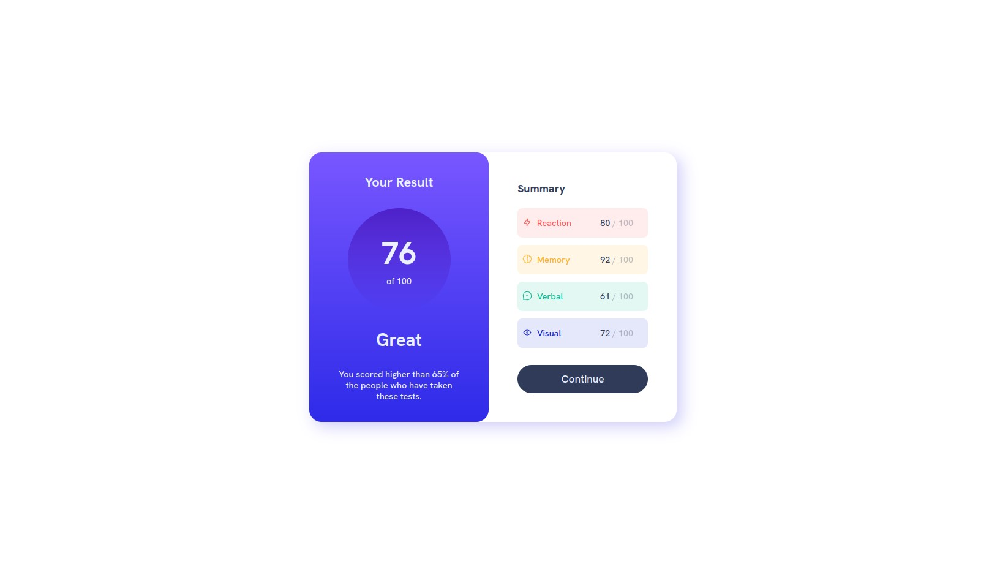
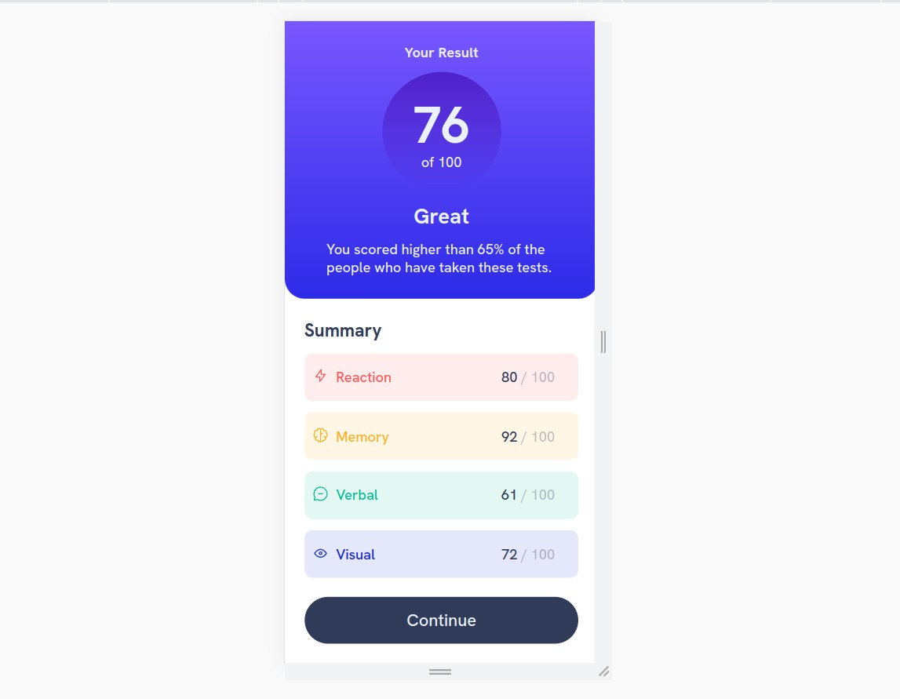

# results-summary-component-main
Frontmentor Challenge


### The challenge

Users should be able to:

- View the optimal layout depending on their device's screen size
- See hover and focus states for interactive elements

### Screenshot





### Links

- Solution URL: [Github](https://github.com/jfan-dev/results-summary-component-main)
- Live Site URL: [Github Pages](https://jfan-dev.github.io/results-summary-component-main/)

### Built with

- Semantic HTML5 markup
- CSS custom properties
- Flexbox
- Mobile-first workflow

### What I learned

Implementation of the hover status for a button as well the cursor style settings. also leaned that you can't (or i was trying in the wrong way) use variables as argument for another variable 🤡.

```css
button:hover {
    background: linear-gradient(var(--L-SLATEBLUE), var(--L-ROYALBLUE));
    cursor:pointer;
}
```

## 🐼 Author

- Jaime Fernandes - jfan.dev@gmail.com
- Frontend Mentor - [@jfan-dev](https://www.frontendmentor.io/profile/jfan-dev)

## Acknowledgments

I want to send a shout-out for my Mother, my Aunts and especially for you Xuxa!
